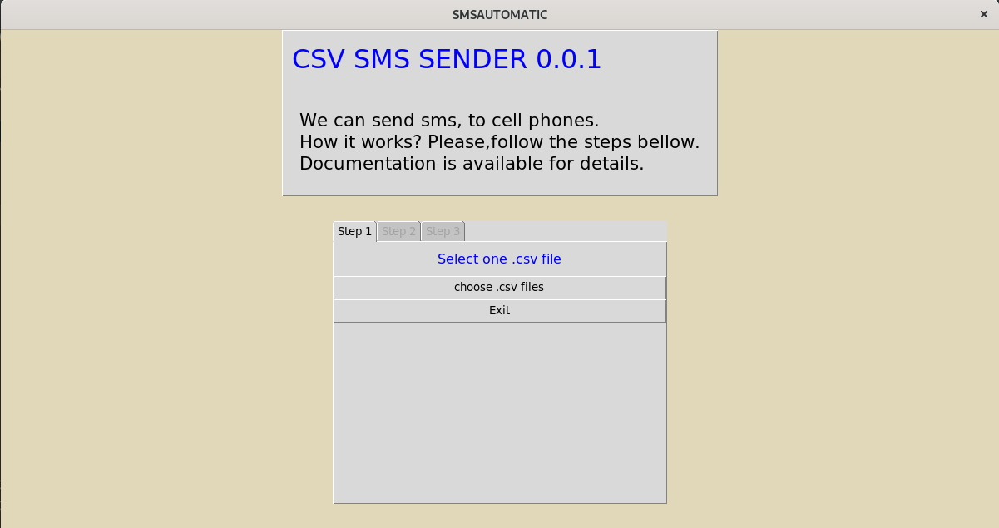
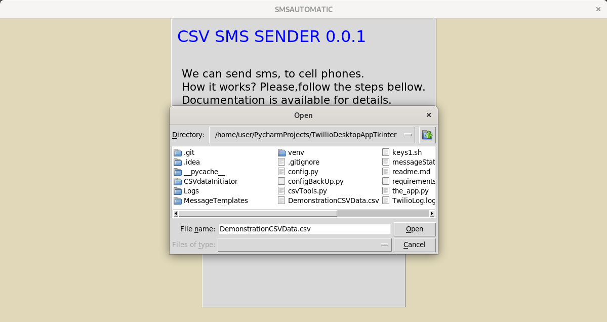
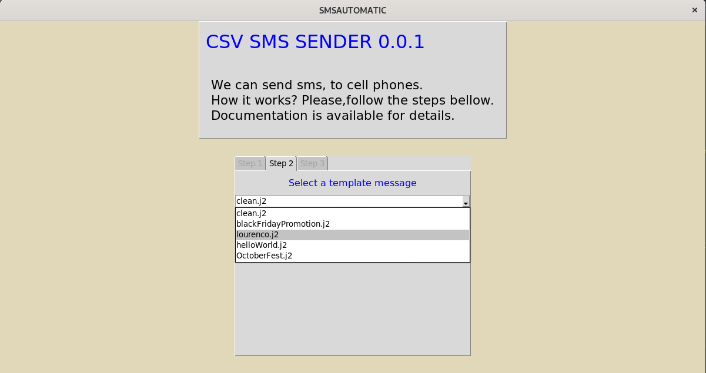
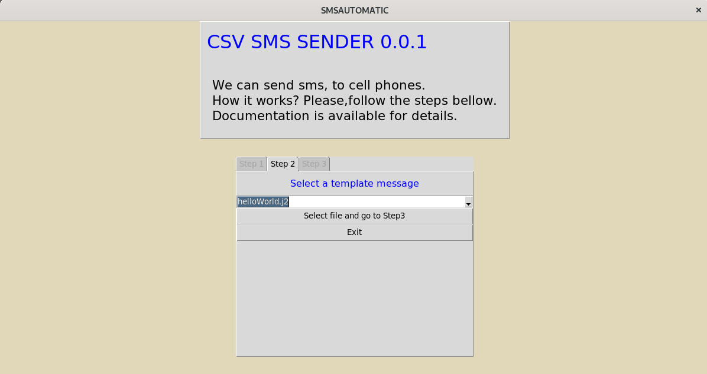
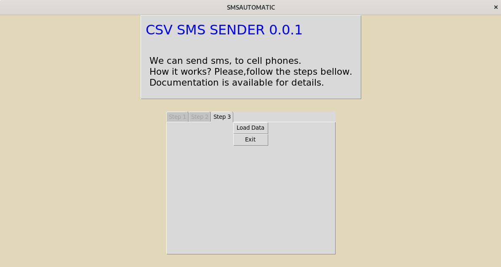
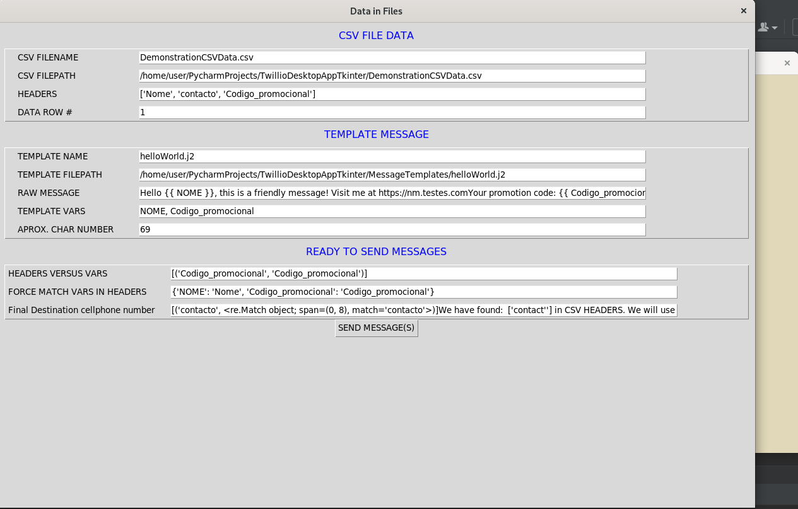

### Project Description
Desktop app,that allows a user to send SMS to mobile phones.
 
The message content is loaded from a template file located in the folder: 'MessageTemplates'
__(We can add and configure more templates)__

How it works:
The aplication will ask a user for a csvfile.
The csv file must contain a contact column, at least.
Then it will ask for a template.
It will load and merge the csv data and the  template variables to form a message, 
and a mobile number recipient.

Note: templates are written in Jinja2 Syntax

### Date
October 2021

### Motivation
 - Interact with TWILIO API
 - Experiments with Python Tkinter 

### Requirements
 1. Previous configuration of a Twilio account [Twilio](https://twilio.com)
 2. Python modules Jinja2 e twilio
 3. Create environment variables with twilio account tokens and message service tokens
    

    E.G.
    export export TWILLIO_SID=ABjkbr2jkçbrsdjkçdsa5d727f5e0df
    export TWILLIO_TOKEN=c3dasde96f27asd13368dsdqq83asdasdsad
    export MESSAGING_MARKETSERVICES=MG23402378920348349289348924889234'

4. Change the value __messaging_service_sid__ in the function __send_message__ from file __twilioSendMessage.py__ to 
   the desired value.

### Application Entry Point:
```$ python the_app.py ```

Screen1

Select "choose .csv.files"

Screen2

Choose a Csv file from the file  system and press "open"

Screen3: Choose a template from the template list



Screen4: Press Select file and go step 3 button


Screen5: Press load data button


Screen6: Press send message(s) button



